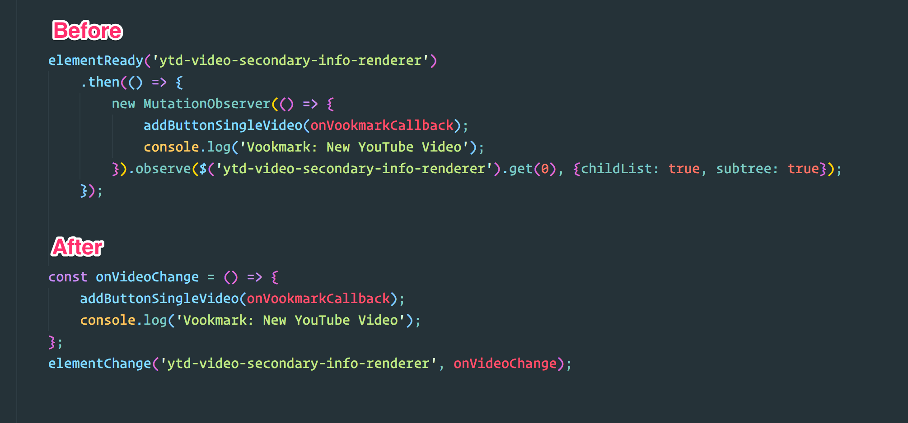

# element-change

> Detect when an element is changed in DOM

## Install

```
$ npm install --save element-change
```


## Usage

```js
const elementChange = require('element-change');

elementChange('#feed',onChangeCallback)
```


## API

### elementChanged(selector)

#### selector

Type: `string`

[CSS selector.](https://developer.mozilla.org/en-US/docs/Web/Guide/CSS/Getting_Started/Selectors)

Waits until element is ready in the DOM using [element-ready](https://github.com/sindresorhus/element-ready)

### onChangeCallback()

Type: `Function`

onChangeCallback() will be called with [MutationRecord](https://developer.mozilla.org/en-US/docs/Web/API/MutationObserver) parameter.

## Example



## Inspiration

- [element-ready](https://github.com/sindresorhus/element-ready)

## License

MIT © [Ashik Nesin](https://ashiknesin.com)
